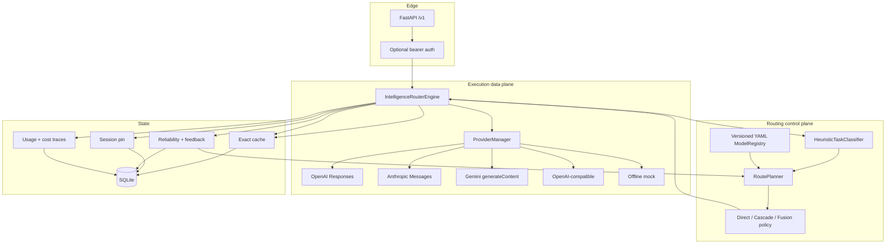
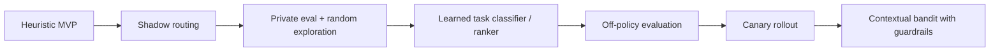

# Intelligence Router MVP Architecture

## 1. 目标与非目标

### 目标

- 以单一 OpenAI-compatible API 暴露异构原生模型服务。
- 在质量护栏下减少不必要的高价模型调用和多模型 token 放大。
- 保留 provider-native reasoning、structured output、tools 与 token 计量。
- 对每次决策给出可审计计划、调用 trace、预算和反事实成本。
- 无 API Key 可本地运行，方便团队先验证产品逻辑。

### MVP 非目标

- 不自动执行客户工具。
- 不提供通用 workflow/DAG 编排平台。
- 不声称启发式 quality prior 等同于真实 benchmark。
- 不尝试在 timeout 后精确判断供应商是否计费。
- 不做跨租户语义缓存。

## 2. 模块图



## 3. 请求生命周期

1. 解析 OpenAI Chat Completions 请求和 `router` 扩展。
2. 对无工具、确定性请求计算租户隔离的 exact-cache key。
3. 命中缓存时直接返回，provider token 与成本均为 0。
4. 用字符/消息/工具 schema 估算规划 token。
5. 零调用分类：task type、complexity、risk、required capabilities。
6. Registry 硬过滤：availability、allow/exclude、provider、context、capability、data boundary、cooldown、budget affordability。
7. 候选评分：质量先验 + 用户反馈 + reliability + pool-relative cost + latency。
8. 选择策略与每阶段输出 cap。
9. 调用 provider；使用供应商返回的 token usage 计费，缺失时才回退到估算。
10. 写 trace、model stats、session pin、cache。
11. 返回标准 completion 和 `router` metadata。

## 4. 策略状态机

### Direct

适合低复杂度、低风险请求。先计算动态质量门槛：

```text
dynamic_floor = min(user_quality_target,
                    0.58 + 0.35 * complexity + 0.25 * risk)
```

`low/medium` 档选择满足门槛的最低成本候选；`high/max` 档选择最高效用候选。供应商错误可以跨候选 fallback，但不做内容级二次调用。

### Cascade

1. 选择 `quality_target - margin` 以上的最低成本模型。
2. 低风险简单格式任务用本地 heuristic verifier。
3. 其余任务用低输出上限的 JSON judge。
4. 仅在失败、低置信度、格式错误或 judge 拒绝时调用强 fallback。
5. Planner 按最坏路径估算成本；executor 在每个串行调用前再次检查剩余预算。

### Fusion

1. 仅从距离最高质量不超过 `0.08` 的模型中选 panel。
2. panel 默认最多 2 个，优先 provider diversity。
3. 无足够近顶级模型时，重复最强模型做独立采样，避免弱模型污染。
4. reference worker 无工具、无 native tools、无 caller system/developer prompt、短输出 cap。
5. 一个 aggregator 同时完成共识/矛盾/遗漏分析和最终写作，并保留工具权限。
6. panel 在规划时整批预留预算后并行；aggregator 仍受实际剩余预算检查。

## 5. 成本模型

规划成本：

```text
estimated_cost = input_tokens * input_rate
               + output_cap * output_rate
```

实际成本支持缓存输入：

```text
actual_cost = uncached_input * input_rate
            + cached_input * cached_rate
            + output * output_rate
```

所有 rate 均来自版本化 registry，不写死在执行代码中。

反事实基线使用：原始输入 token + 最终可见答案 token，按最强合格模型费率计算。这样不会因为 `max_tokens` 很大而夸大节省。

## 6. 数据模型

SQLite 表：

- `cache`：key、JSON response、过期时间。
- `sessions`：租户前缀 session key、pinned model、过期时间。
- `traces`：最终模型、任务、策略、实际成本、tokens、时延、cache hit。
- `model_stats`：任务 × 模型的调用数、成功/失败、EWMA latency、反馈均值、最近故障。
- `feedback`：trace 级原始用户评分和备注。

生产版建议：Redis 做 cache/session，Postgres 做配置与反馈，ClickHouse/OTel 做高吞吐 trace。

## 7. 可靠性设计

- 默认 `IR_MAX_RETRIES=0`：timeout 之后自动重试可能双重计费；优先模型 fallback。
- HTTP 408/409/429/5xx 被标记为 retryable，客户可显式开启有限重试。
- 模型失败进入短期 cooldown，不参与普通自动路由。
- Direct 也有 provider-error fallback，但只有实际失败才产生额外调用。
- 实际成本超过预算估算时不掩盖，返回 `budget_overrun=true`。
- Registry 缺 Key 的模型自动不可用，路由预览会展示原因。

## 8. 安全与隐私

- `X-Tenant-ID` 进入 cache/session key，避免跨租户命中。
- 工具请求不做 exact cache，避免重放过期 side-effect intent。
- 非零 temperature 不缓存。
- `data_boundary=local_only` 只允许 `data_boundary: local` 模型。
- reference worker 不见 caller system prompt，减少敏感提示扩散。
- 原始 prompt 默认不写日志；SQLite cache 仍可能含请求结果，生产版需加密、TTL、PII 策略和租户删除 API。
- 聚合 prompt 将 reference 明确标记为不可信数据，降低 prompt injection 影响。

## 9. 原生适配器边界

### OpenAI Responses

- `reasoning.effort`
- function tools 转 flat tool schema
- `web_search`、`file_search`、`computer_use`
- text JSON / JSON schema format
- cached/reasoning token usage

### Anthropic Messages

- system/developer 合并到 system
- OpenAI function schema 转 Anthropic tools
- tool result message
- `output_config.effort` 与 JSON schema
- cache-read token usage

### Gemini generateContent

- system instruction
- text、data URI image、file URI parts
- function declarations / function response
- response MIME 与 JSON schema
- cached/thought token usage

### OpenAI-compatible

- Chat Completions messages/tools/response format
- 可选 reasoning effort tag
- 兼容 DeepSeek、OpenRouter、LiteLLM、vLLM 等

## 10. 生产化演进



建议 learned router 输出的不是单一模型 ID，而是候选分布、置信区间和升级策略。保留 hard policy 层处理隐私、合规、预算与工具能力；机器学习不可绕过这些约束。
