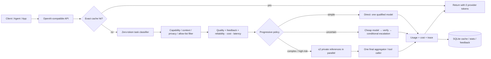

# Intelligence Router MVP

一个面向 **LLM Native AI Service** 的统一智能路由层：用 OpenAI-compatible 的单一入口，在 OpenAI、Anthropic、Gemini、DeepSeek、OpenRouter/兼容端点与本地 vLLM 之间，按任务、能力、质量、成本、时延、隐私边界和在线反馈进行调度。

它不是“每个请求都让一群模型开会”。核心原则是 **Progressive Intelligence（渐进式智能）**：

1. **Exact Cache / Policy Gate**：能不调用模型就不调用。
2. **Direct**：简单任务只调用一个达到动态质量门槛的低成本模型。
3. **Cascade**：先便宜模型，只有失败或低置信度才验证/升级。
4. **Bounded Fusion**：只有复杂、高风险、多视角任务才并行参考；默认最多两个参考调用，并由一个聚合模型同时完成比较与最终写作。

> 选择便宜模型通常节省的是 **美元成本**，不一定减少输入 token 数。真正减少 token 的手段是缓存、上下文压缩、输出预算和避免不必要的多模型调用。本 MVP 已实现前三者中的 exact cache、输出预算与有界多模型；语义缓存和上下文压缩列入下一阶段。


## 已交付能力

- OpenAI-compatible `POST /v1/chat/completions`
- 响应式产品 Landing Page 与实时 Router Playground（`GET /`）
- 零模型调用的透明任务分类器
- 能力、上下文、数据边界、供应商 allow/exclude 过滤
- `low / medium / high / max` 成本—质量档位
- 保守预算上限规划；串行阶段逐调用检查，Fusion 并行 panel 按整批预留
- Direct、Cascade、Fusion 三种执行策略
- 私有参考 worker 无工具、无调用方 system prompt；最终 aggregator 才是实际工具调用者
- 模型故障 fallback 与短期熔断
- 会话粘性，减少行为漂移并提高上游 prompt-cache 命中机会
- SQLite exact cache、trace、成本、模型可靠性与反馈学习
- OpenAI Responses、Anthropic Messages、Gemini generateContent 原生适配器
- DeepSeek、OpenRouter、LiteLLM、vLLM 等 OpenAI-compatible 适配器
- 无 API Key 也能运行的三个 deterministic mock 模型
- Docker、17 个自动化测试、离线验证脚本

## 架构



更完整的组件、状态机和生产化设计见 [ARCHITECTURE.md](ARCHITECTURE.md)，研究结论见 [RESEARCH.md](RESEARCH.md)。

## 5 分钟启动

要求 Python 3.11+。

```bash
git clone https://github.com/shaoqisama/intelligence-router.git
cd intelligence-router
python -m venv .venv
source .venv/bin/activate
pip install -e .[dev]
cp .env.example .env
pytest -q
uvicorn intelligence_router.main:app --host 0.0.0.0 --port 8000
```

默认只有 `mock/fast`、`mock/balanced`、`mock/smart` 可用，因此不需要任何云端 Key。产品 Landing Page 在 `/`，实时 Playground 会调用当前实例的真实路由 API；Swagger UI 在 `/docs`。

## Landing Page 与实时 Playground

启动服务后访问：

```text
http://localhost:8000/
```

Landing Page 围绕 MVP 已实现的服务价值展开，而不是展示静态伪数据：

- 解释 Exact Cache → Direct → Cascade → Bounded Fusion 的渐进式计算策略；
- 展示预算、质量门槛、数据边界、模型池与可观测 trace 的价值；
- 提供可编辑任务、策略、成本档位、单请求预算和质量目标；
- `Preview route` 直接调用 `/v1/route/preview`，不会产生 provider 调用或 token；
- `Run request` 直接调用 `/v1/chat/completions`，展示最终回答、实际成本、旗舰反事实、token 与模型路径；
- 支持设置租户 ID 和受保护部署的 Bearer Token；
- 页面、CSS、JavaScript 和 favicon 均随 Python wheel 打包，不依赖 CDN 或第三方前端运行时。

使用 Docker：

```bash
cp .env.example .env
docker compose up --build
```

## 最小请求

```bash
curl http://localhost:8000/v1/chat/completions \
  -H 'Content-Type: application/json' \
  -H 'X-Tenant-ID: demo' \
  -d '{
    "model": "intelligence-router/auto",
    "messages": [{"role": "user", "content": "总结这段客户反馈"}],
    "max_tokens": 300,
    "router": {
      "max_cost_usd": 0.02,
      "cost_tier": "medium",
      "session_id": "case-123",
      "explain": true
    }
  }'
```

响应保持 OpenAI Chat Completions 结构，并增加 `router`：

```json
{
  "model": "mock/fast",
  "choices": [{"message": {"role": "assistant", "content": "..."}}],
  "usage": {"prompt_tokens": 18, "completion_tokens": 12, "total_tokens": 30},
  "router": {
    "trace_id": "ir_...",
    "strategy": "direct",
    "selected_model": "mock/fast",
    "actual_cost_usd": 0.0000021,
    "estimated_baseline_cost_usd": 0.000092,
    "estimated_savings_pct": 97.7,
    "cache_hit": false,
    "plan": {},
    "trace": {}
  }
}
```

`estimated_baseline_cost_usd` 是一个 like-for-like 反事实：同一原始输入与最终可见输出长度，若直接调用当前最强合格模型的估算成本。Fusion 可能显示负节省，这是预期且诚实的结果。

## 路由预览：零模型调用

```bash
curl http://localhost:8000/v1/route/preview \
  -H 'Content-Type: application/json' \
  -d '{
    "model": "intelligence-router/auto",
    "messages": [{"role": "user", "content": "深度研究并对比三种数据库迁移方案"}],
    "router": {"max_cost_usd": 0.05}
  }'
```

预览返回任务类型、复杂度、风险、候选模型得分、预算、计划调用和每阶段输出上限，但不会调用任何 LLM。

## 路由参数

| 参数 | 默认值 | 作用 |
|---|---:|---|
| `strategy` | `auto` | `direct`、`cascade`、`fusion` 或自动 |
| `cost_tier` | `medium` | 成本与质量权重档位 |
| `max_cost_usd` | `IR_DEFAULT_MAX_COST_USD` | 单请求预算上限 |
| `quality_target` | `0.80` | 质量先验门槛；简单任务会使用动态下调门槛 |
| `latency_slo_ms` | `15000` | 候选模型时延评分基准 |
| `risk` | `auto` | 允许业务方覆盖风险等级 |
| `allowed_models` | `[]` | 支持 glob，如 `anthropic/*` |
| `excluded_models` | `[]` | 模型黑名单 |
| `allowed_providers` | `[]` | 供应商白名单 |
| `required_capabilities` | `[]` | 如 `vision`、`json`、`reasoning` |
| `data_boundary` | `any` | `any`、`regional_or_local`、`local_only` |
| `cache` | `true` | exact cache；工具请求与非零温度自动禁用 |
| `session_id` | `null` | 会话粘性键，按租户隔离 |
| `verification` | `auto` | `none`、`heuristic`、`judge` |
| `max_panel_models` | `2` | Fusion 参考 worker，MVP 最大值为 2 |
| `native_tools` | `[]` | 如 OpenAI 的 `web_search`、`file_search` |

快捷模型别名：

- `intelligence-router/auto`：自动渐进式执行
- `intelligence-router/fast`：低成本 direct
- `intelligence-router/quality`：高质量 cascade
- `intelligence-router/fusion`：有预算上限的多模型融合
- 也可直接指定注册表模型，如 `anthropic/claude-sonnet-5`

## 原生能力保留

| 适配器 | 接口 | 保留的能力 |
|---|---|---|
| OpenAI | Responses API | reasoning effort、function tools、web/file/computer native tools、structured output、缓存/推理 token 计量 |
| Anthropic | Messages API | system、tool use/result、`output_config.effort`、JSON schema、缓存 token 计量 |
| Gemini | `generateContent` | multimodal content、function calling、JSON schema、thinking/cached token 计量 |
| OpenAI-compatible | `/chat/completions` | tools、JSON、reasoning effort（按 registry tag）、缓存/推理 token 计量 |

OpenRouter 可以作为兼容端点加入，但建议给它配置**固定模型**，避免“本路由器调用另一个自动路由器”造成不可解释的递归策略和双重成本优化。

## 添加模型

编辑 `config/models.yaml`：

```yaml
- id: my-provider/my-model
  provider: my-provider
  adapter: openai_compatible
  provider_model: upstream-model-id
  api_key_env: MY_PROVIDER_API_KEY
  base_url: https://example.com/v1
  pricing:
    input_per_million: 0.50
    output_per_million: 2.00
  context_window: 131072
  max_output_tokens: 8192
  expected_latency_ms: 1200
  quality:
    general: 0.80
    coding: 0.86
    reasoning: 0.84
  capabilities: [text, json, tools, reasoning]
  data_boundary: external
  tags: [reasoning, sampling]
```

质量分数是启动先验，不应长期手填不变。生产系统应以私有 eval、人工反馈和任务成功率持续更新。

## 反馈学习

```bash
curl http://localhost:8000/v1/feedback \
  -H 'Content-Type: application/json' \
  -d '{"trace_id": "ir_...", "score": 0.9, "note": "客户采纳"}'
```

反馈以任务类型 × 模型维度做增量均值，并最多占候选质量分数的 25%，避免少量反馈立刻劫持路由。

## 验证与演示

```bash
pytest -q
python scripts/demo_benchmark.py --output MVP_VALIDATION.md --json benchmark_results.json
```

该验证使用离线 mock 模型，目的是验证策略、预算、trace、缓存和升级路径，不代表真实模型质量 benchmark。真实上线前必须用企业自己的任务分布、golden set 与盲评数据重标定 `quality`。

更多请求示例见：

- [examples/requests.http](examples/requests.http)
- [examples/python_client.py](examples/python_client.py)

## 当前 MVP 的边界

- 仅非流式 Chat Completions；不自动执行工具，只返回 tool calls。
- 任务分类器和质量先验是透明启发式，不是已训练的 learned router。
- 只有 exact cache，没有 embedding semantic cache 或长对话压缩。
- SQLite 适合单实例 MVP；生产应替换为 Redis/Postgres/ClickHouse 或可观测性平台。
- Provider timeout 后无法确认上游是否计费，因此默认不重试；优先跨模型 fallback。
- 预算是基于公开费率与 token 估计的保守控制，不含供应商阶梯折扣、Batch、地区税费或工具附加费。
- Fusion 的反馈暂归因到最终 aggregator；生产版应做多触点 credit assignment。
- 配置中的价格快照日期为 **2026-08-09**，上线前必须自动同步供应商价格与模型生命周期。

## 推荐的下一阶段

1. 用真实日志构建 `task → model reward` 数据集，训练轻量分类/排序头。
2. 加入 shadow routing、A/B 与 off-policy evaluation，避免在线试错伤害客户。
3. 上语义缓存、对话状态摘要、retrieval-aware prompt trimming，直接减少 token。
4. 将 verifier 改成任务专用：代码执行、JSON schema、事实检索、SQL dry-run、业务规则。
5. 加租户预算账本、速率限制、地区路由、PII 检测、审计日志与 KMS。
6. 引入模型价格/可用性自动同步和 canary health probes。
7. 以 Pareto frontier（质量、成本、P95 延迟、成功率）替代单一 leaderboard。

## License

Apache-2.0。见 [LICENSE](LICENSE)。
